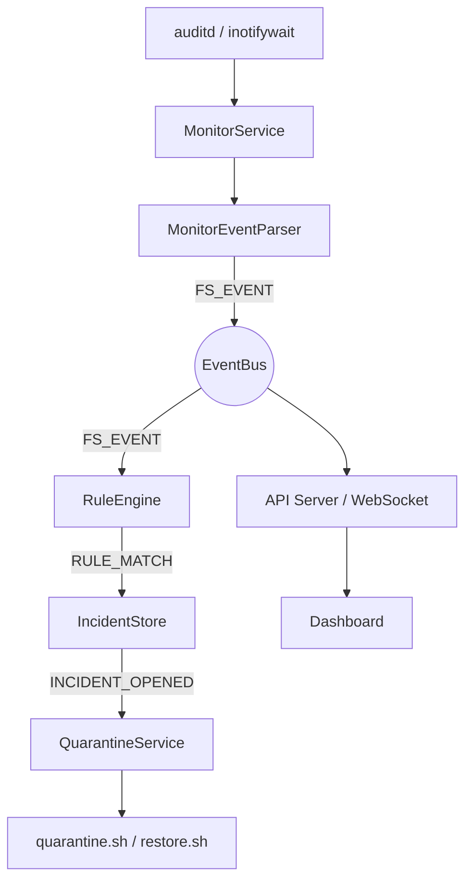

# Team404 - Linux 랜섬웨어 실시간 탐지 및 격리 시스템

Linux 환경에서 감시 대상 디렉터리의 파일 시스템 이벤트를 실시간으로 수집하고, 짧은 시간 안에 대량 수정·생성·이름 변경·의심 확장자 변경이 발생하면 랜섬웨어 유사 행위로 판단해 Incident 생성, 자동 격리, 복구, 대시보드 표시까지 수행하는 경량 PoC 프로젝트입니다.

실제 랜섬웨어를 제작하거나 실행하지 않고, `tmp/demo-target` 아래의 데모 파일을 Base64로 변형한 뒤 `.demo.locked` 확장자로 변경하는 안전한 시뮬레이션으로 탐지 흐름을 검증합니다.

## 팀원

| 이름 | 학번 | 역할 |
| --- | ---: | --- |
| 어승경 | 2023203068 | 팀장, 전체 구조 설계, 파일 감시 시스템 설계 및 구현, 모듈 연동, 최종 발표 |
| 정시은 | 2025404032 | 권한 제어 및 격리 방식 설계, 자동 격리 로직 구현, 복구 흐름 구현 |
| 방주현 | 2025403033 | 대시보드 설계 및 구현, 이벤트·Incident·격리 상태 시각화 |
| 정연진 | 2025404018 | 랜섬웨어 유사 행위 데모 프로그램 설계 및 구현, 시연 시나리오 구성 |
| 염도윤 | 2026403019 | 프로젝트 문서화, 동작 흐름 정리, 실행 방법과 발표 자료 관리 |

## 핵심 기능

| 구분 | 내용 |
| --- | --- |
| 파일 감시 | `auditd` 또는 `inotifywait` 기반 파일 이벤트 수집 |
| 이벤트 정규화 | create, modify, delete, rename 형식의 `FS_EVENT`로 통일 |
| 행위 기반 탐지 | 확장자 위험도와 이벤트 종류별 배율을 누적해 burst 탐지 |
| Incident 관리 | `RULE_MATCH` 발생 시 Incident, Alert, 격리 작업 상태 저장 |
| 자동 대응 | 권한 잠금, 의심 프로세스 종료, 시스템 종료 옵션을 정책으로 제어 |
| 복구 | 격리 전 권한을 저장하고 restore 요청 시 원래 권한으로 복원 |
| 대시보드 | REST API와 직접 구현한 WebSocket으로 실시간 상태 표시 |
| 데모 | 실제 악성코드 없이 안전한 파일 변조 시나리오 제공 |

## 동작 흐름



RuleEngine은 파일 확장자 위험도와 create, modify, rename 이벤트 배율을 함께 계산합니다. 누적 가중치가 임계값을 넘으면 `RULE_MATCH`가 발생하고, IncidentStore가 Incident를 만든 뒤 QuarantineService가 설정된 대응 정책에 따라 감시 디렉터리를 잠급니다.

## 기술 스택

| 영역 | 사용 기술 |
| --- | --- |
| 런타임 | Node.js 20 이상 |
| API 서버 | Node.js native `http` |
| 실시간 통신 | 직접 구현한 WebSocket |
| 대시보드 | Vanilla HTML, CSS, JavaScript |
| 파일 감시 | Linux `auditd`, `inotifywait` |
| 자동 대응 | Bash, `chmod`, `lsof`, `systemctl`, `poweroff` |
| 테스트 | Node.js 내장 test runner |

## 실행 방법

### 요구 사항

- Node.js 20 이상
- Linux 환경
- Bash
- `inotifywait` 사용 시 `inotify-tools`
- `auditd` 백엔드 사용 시 `auditd`, `auditctl`, 감사 로그 접근 권한

### 실행

```bash
sudo npm run dev
```

기본 설정 파일은 `ops/sample-config/app-config.json`입니다. 서버가 실행되면 대시보드는 기본적으로 `http://127.0.0.1:3000`에서 확인할 수 있습니다.

운영 방식으로 실행하려면 다음 명령을 사용합니다.

```bash
npm run start
```

다른 설정 파일을 지정하려면 `--config` 옵션을 사용합니다.

```bash
node src/server.js --config ops/sample-config/app-config.json
```

감시 대상은 설정 파일의 `monitor.targets[].rootPath` 또는 대시보드에서 변경할 수 있습니다. `backendMode`는 `auto`, `auditd`, `inotify` 중 하나이며, `auto`는 먼저 `auditd`를 시도한 뒤 실패하면 `inotifywait`로 폴백합니다.

### 테스트

```bash
npm run test
```

## 주요 API

| Method | Endpoint | 기능 |
| --- | --- | --- |
| GET | `/api/health` | 서버, 감시, 데모 상태 조회 |
| GET | `/api/snapshot` | 대시보드용 전체 상태 조회 |
| GET | `/api/incidents` | Incident 목록 조회 |
| GET | `/api/alerts` | Alert 목록 조회 |
| GET | `/api/quarantine-jobs` | 격리 작업 목록 조회 |
| POST | `/api/incidents/:id/restore` | Incident 권한 복구 |
| POST | `/api/demo/start` | 데모 시작 |
| POST | `/api/demo/stop` | 데모 중단 |
| POST | `/api/demo/reset` | 데모 파일 초기화 |
| GET/PUT | `/api/settings/demo` | 데모 파일 개수 조회 및 변경 |
| GET/PUT | `/api/settings/monitor` | 감시 백엔드 조회 및 변경 |
| GET/PUT | `/api/settings/response-policy` | 자동 대응 정책 조회 및 변경 |
| GET/PUT | `/api/settings/detection-policy` | 탐지 정책 조회 및 변경 |
| POST | `/api/settings/detection-policy/reset` | 탐지 정책 기본값 복원 |
| POST | `/api/watch/target` | 감시 대상 디렉터리 변경 |
| POST | `/api/watch/toggle` | 파일 감시 시작 및 중지 |

WebSocket은 `/` 또는 `/ws` 업그레이드 요청을 통해 연결되며, `FILE_EVENT`, `RULE_WEIGHT_UPDATED`, `RULE_MATCH`, `QUARANTINE_*`, `RESTORE_COMPLETED`, `DEMO_*`, `SYSTEM_HEALTH` 이벤트를 브라우저로 전달합니다.

## 프로젝트 구조

```text
.
├── README.md
├── package.json
├── DESIGN.md
├── dev/
│   └── letsmake.md
├── docs/
│   ├── Team404_최종보고서.md
│   ├── development-plan.md
│   ├── team404-presentation-script.md
│   └── ppt/
├── ops/
│   ├── common-file-extensions.json
│   ├── default-detection-policy.json
│   ├── config/
│   │   └── monitor.sh
│   ├── sample-config/
│   │   └── app-config.json
│   └── scripts/
│       ├── demo.sh
│       ├── quarantine.sh
│       └── restore.sh
├── public/
│   ├── index.html
│   ├── app.js
│   └── style.css
├── src/
│   ├── app/
│   ├── collector/
│   ├── incidents/
│   ├── isolation/
│   ├── rules/
│   ├── server/
│   ├── shared/
│   ├── simulator/
│   └── server.js
├── test/
└── tmp/
```

### `src/app`

- `runtime.js`: MonitorService, RuleEngine, IncidentStore, QuarantineService를 연결하고 데모, 감시 대상, 정책 변경, snapshot/health 상태를 관리합니다.
- `runtime-options.js`: CLI 인자와 `--config` 옵션을 처리합니다.

### `src/collector`

- `monitor-service.js`: `auditd`와 `inotify` 백엔드를 시작·중지하고, 감시 상태와 폴백을 관리합니다.
- `monitor-event-parser.js`: `inotifywait` 출력과 audit 로그를 내부 `FS_EVENT` 형식으로 정규화합니다. `MOVED_FROM`/`MOVED_TO`는 짧은 시간 안에 묶어 `rename`으로 병합합니다.

### `src/rules`

- `rule-engine.js`: 확장자 가중치, 이벤트 배율, decay, target별 bucket을 이용해 랜섬웨어 유사 burst를 탐지합니다.
- `extension-weight-loader.js`: 기본 확장자 목록과 사용자 탐지 정책을 결합해 이벤트별 가중치를 계산합니다.

### `src/incidents`

- `incident-store.js`: `RULE_MATCH`를 Incident와 Alert로 저장하고, 격리·복구 상태 변화를 관리합니다.

### `src/isolation`

- `quarantine-service.js`: `INCIDENT_OPENED`를 받아 자동 격리를 수행하고, 복구 요청 시 저장된 권한을 되돌립니다.
- `quarantine-logger.js`: 격리와 복구 진행 로그를 `logs/quarantine.log`에 기록합니다.

### `src/server`

- `create-api-server.js`: 정적 대시보드 파일 제공, REST API, WebSocket 브로드캐스트를 담당합니다.
- `src/server.js`: 설정 로드, runtime 시작, API 서버 실행, 종료 시그널 처리를 담당하는 엔트리포인트입니다.

### `src/shared`

- `contracts/event-names.js`: 내부 이벤트 이름, 파일 이벤트 타입, Incident 상태, API route 상수를 정의합니다.
- `config/load-app-config.js`: 설정 파일을 로드하고 경로, 감시 대상, 탐지 정책을 정규화합니다.
- `config/detection-policy.js`: 탐지 정책 기본값과 검증 로직을 제공합니다.

### `src/simulator`

- `demo.js`: 데모 대상 파일 생성, Base64 변형, `.demo.locked` rename, 데모 복구와 초기화를 처리합니다.
- `demo-worker.js`: 데모 실행을 별도 프로세스에서 수행합니다.

### `ops`

- `config/monitor.sh`: `inotifywait` 기반 감시 스크립트입니다.
- `scripts/quarantine.sh`: 감시 대상 파일과 디렉터리에 `chmod 000`을 적용합니다.
- `scripts/restore.sh`: 저장된 원래 권한으로 파일과 디렉터리를 복구합니다.
- `sample-config/app-config.json`: 서버, 감시 대상, 감시 백엔드, 데모 파일 수, 탐지 정책 예시입니다.
- `default-detection-policy.json`: 대시보드에서 탐지 정책을 초기화할 때 사용하는 기본 정책입니다.
- `common-file-extensions.json`: 정상 확장자 판별에 사용하는 공통 확장자 목록입니다.

### `public`

대시보드 UI입니다. 감시 상태, 감시 경로, 현재 탐지 가중치, 파일 이벤트 로그, Incident 목록, 격리 작업, 대응 정책, 탐지 정책, 감시 백엔드, 데모 실행 상태를 표시합니다.

### `test`

Node.js 내장 test runner 기반 테스트입니다. API 서버, runtime, monitor parser/service, rule engine, incident store, quarantine service, config loader, watch toggle 흐름을 검증합니다.

## 설정 파일 개요

`ops/sample-config/app-config.json`의 주요 항목은 다음과 같습니다.

| 항목 | 설명 |
| --- | --- |
| `server.host`, `server.port` | API 서버와 대시보드 바인딩 주소 |
| `monitor.scriptPath` | `inotifywait` 백엔드에서 사용할 감시 스크립트 경로 |
| `monitor.backendMode` | `auto`, `auditd`, `inotify` 중 선택 |
| `monitor.targets` | 감시 대상 디렉터리 목록 |
| `demo.fileCount` | 데모에서 생성·변형할 파일 수 |
| `detectionPolicy.thresholdWeight` | 누적 가중치 탐지 임계값 |
| `detectionPolicy.weights` | 확장자 종류별 기본 위험도 |
| `detectionPolicy.eventMultipliers` | 이벤트 종류별 배율 |
| `detectionPolicy.weightDecay` | 오래된 이벤트 가중치 감쇄 설정 |
| `customExtensionWeights` | 프로젝트별 확장자 가중치 보정 |

## 대응 정책

대응 정책은 대시보드 또는 `/api/settings/response-policy`에서 변경할 수 있습니다.

| 단계 | 설정 | 설명 |
| --- | --- | --- |
| 1단계 | `lockDirectoryPermissions` | 감시 대상 파일과 디렉터리 권한을 `000`으로 잠급니다. |
| 2단계 | `killSuspectProcesses` | auditd로 PID 추적이 가능할 때 의심 프로세스 종료를 시도합니다. |
| 3단계 | `shutdownSystem` | 긴급 대응으로 시스템 종료를 요청합니다. 실습 VM 등 통제된 환경에서만 사용해야 합니다. |
| 범위 | `quarantineScope` | 발생 디렉터리만 격리하거나 전체 감시 디렉터리를 격리합니다. |

## 참고 문서

- 최종 보고서: `docs/Team404_최종보고서.md`
- 발표 자료 원고: `docs/team404-presentation-script.md`
- 발표 슬라이드 초안: `docs/ppt/`
- 개발 계획: `docs/development-plan.md`
- 개발 워크플로우: `dev/letsmake.md`, `letsmake.md`
