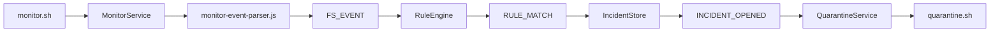
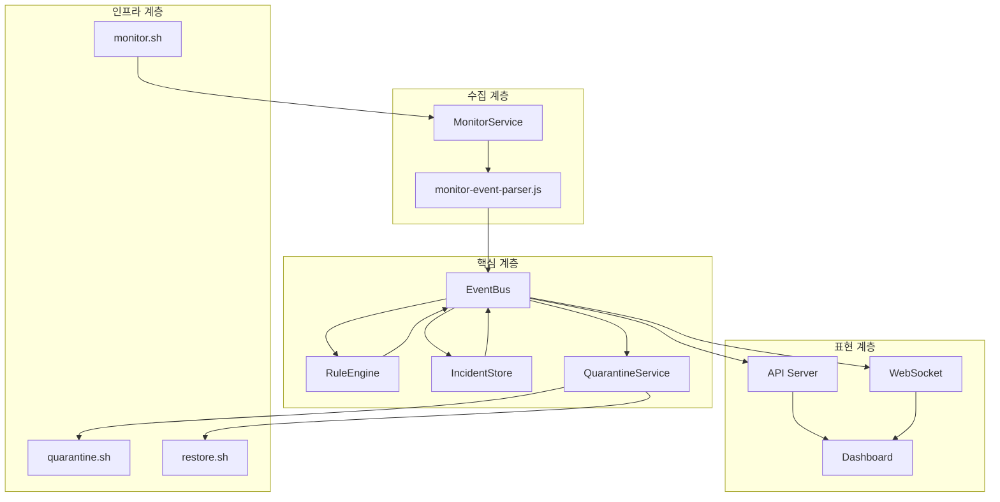

# 02. 시스템 아키텍처 및 기술 스택

## 1. 개요

Team 404의 Linux 랜섬웨어 모니터링 시스템은 "감시 → 탐지 → 기록 → 격리"라는 단일 파이프라인을 중심으로 구성됩니다. 각 단계는 이벤트 버스를 통해 느슨하게 결합되어 있으며, 모듈별로 독립적으로 교체하거나 테스트할 수 있는 구조입니다.

## 2. 전체 데이터 흐름

시스템의 핵심 흐름은 다음과 같습니다.



1. `monitor.sh`가 `inotifywait`로 파일 시스템 이벤트를 수집합니다.
2. `MonitorService`가 모니터 프로세스를 실행하고 출력을 읽습니다.
3. `monitor-event-parser.js`가 raw 출력을 정규화하여 표준 이벤트로 변환합니다.
4. 정규화된 이벤트가 `FS_EVENT`로 이벤트 버스에 발행됩니다.
5. `RuleEngine`이 가중치 기반 버스트 탐지를 수행합니다.
6. 임계치를 초과하면 `RULE_MATCH`가 발행됩니다.
7. `IncidentStore`가 인시던트를 생성하고 `INCIDENT_OPENED`를 발행합니다.
8. `QuarantineService`가 자동 격리를 수행하고 `quarantine.sh`를 호출합니다.

## 3. 모듈 관계도



## 4. 기술 스택

| 구분 | 기술 | 비고 |
|------|------|------|
| 런타임 | Node.js >= 20 | `package.json`의 `engines` 필드 참조 |
| 모듈 시스템 | ESM | `"type": "module"` 설정 사용 |
| HTTP 서버 | native `node:http` | Express 미사용. `src/server/create-api-server.js`에서 직접 구현 |
| WebSocket | hand-rolled | `ws` 라이브러리 미사용. `create-api-server.js`에서 수동 핸드셰이크 및 서버 송신 프레임 인코딩 구현 |
| 파일 감시 | bash + `inotifywait` | `ops/config/monitor.sh` 및 `auditd` 지원 |
| 프론트엔드 | vanilla HTML / CSS / JS | `public/app.js`, `public/index.html` 참조 |
| 테스트 | node:test | 내장 테스트 러너 사용 |

### 주의사항

- **Express는 사용하지 않습니다.** HTTP 서버는 Node.js 내장 `node:http` 모듈로 직접 작성되어 있습니다. (`src/server/create-api-server.js`)
- **IBM Carbon은 설치된 npm 패키지가 아닙니다.** `DESIGN.md`에 기록된 색상과 타이포그래피 규칙은 스타일 가이드 참조용이며, 실제 대시보드는 vanilla CSS로 구현되어 있습니다. `package.json`에는 `@carbon/*` 의존성이 없습니다.

## 5. 디렉터리 구조

```
team404/
├── ops/
│   ├── config/
│   │   └── monitor.sh          # inotifywait 기반 파일 감시 스크립트
│   └── scripts/
│       ├── quarantine.sh       # 권한 잠금 (chmod 000, 실제 코드 기준)
│       ├── restore.sh          # 권한 복원 (기록된 originalMode 복원, 실제 코드 기준)
│       └── demo.sh             # 데모 CLI 래퍼
├── src/
│   ├── app/
│   │   └── runtime.js          # 컴포지션 루트. 서비스 연결 및 라이프사이클 관리
│   ├── collector/
│   │   ├── monitor-service.js  # 모니터 백엔드 실행 및 관리
│   │   └── monitor-event-parser.js  # raw 출력 → 표준 이벤트 정규화
│   ├── incidents/
│   │   └── incident-store.js   # 인시던트/알림/격리 작업 상태 관리
│   ├── isolation/
│   │   └── quarantine-service.js  # 자동 격리/복구, 권한 잠금
│   ├── rules/
│   │   └── rule-engine.js      # 확장자 가중치 기반 버스트 탐지
│   ├── server/
│   │   └── create-api-server.js  # native HTTP + hand-rolled WebSocket
│   ├── shared/
│   │   ├── contracts/
│   │   │   └── event-names.js  # 이벤트명, 상태, API 경로 상수
│   │   ├── config/
│   │   │   └── load-app-config.js  # 설정 로드/정규화
│   │   └── utils/
│   │       └── create-event-bus.js  # EventEmitter 래퍼 (max 100 listeners)
│   ├── simulator/
│   │   ├── demo.js             # 데모 파일 생성/암호화 시뮬레이션
│   │   └── demo-worker.js      # forked 데모 워커
│   └── server.js               # 부트스트랩. 설정 로드 → 런타임 시작 → HTTP 서버 실행
├── public/
│   ├── index.html              # 대시보드 HTML
│   ├── style.css               # 대시보드 스타일
│   └── app.js                  # 대시보드 클라이언트 (vanilla JS)
└── test/
    └── *.test.js               # node:test 기반 테스트
```

## 6. 핵심 모듈 상세

### 6.1 Bootstrap: `src/server.js`

- 실행 옵션 파싱 (`src/app/runtime-options.js`)
- 설정 로드 (`src/shared/config/load-app-config.js`)
- 런타임 생성 및 시작 (`src/app/runtime.js`)
- API 서버 생성 및 리스닝 (`src/server/create-api-server.js`)
- SIGINT / SIGTERM graceful shutdown 처리

### 6.2 Composition Root: `src/app/runtime.js`

모든 서비스를 생성하고 이벤트 버스로 연결하는 오케스트레이터입니다.

- `createEventBus()`로 이벤트 버스 생성
- `MonitorService`, `RuleEngine`, `IncidentStore`, `QuarantineService` 인스턴스화
- 데모 모드 제어 (`startDemo`, `stopDemo`, `resetDemo`)
- 스냅샷 및 헬스 상태 집계 (`getSnapshot`, `getHealth`)
- 설정 영속화 (config 파일에 detectionPolicy, monitor targets 등 저장)

### 6.3 Event Bus: `src/shared/utils/create-event-bus.js`

Node.js 내장 `EventEmitter`를 래핑한 단순 이벤트 버스입니다. 최대 리스너 수는 100으로 설정되어 있습니다. 모든 모듈은 이 버스를 통해 느슨하게 결합됩니다.

### 6.4 File Monitor: `src/collector/monitor-service.js`

감시 백엔드를 추상화한 서비스입니다.

- 지원 백엔드: `auto`, `auditd`, `inotify`
- `auto` 모드에서는 auditd를 먼저 시도하고, 실패하면 inotify로 폴백
- 백엔드 프로세스(`monitor.sh` 또는 `tail -F /var/log/audit/audit.log`) 실행 및 재시작 관리
- `FS_EVENT` 발행
- 시스템 헬스 상태 발행 (`SYSTEM_HEALTH`)

### 6.5 Event Parser: `src/collector/monitor-event-parser.js`

`monitor.sh`와 `auditd`의 출력을 표준 이벤트로 정규화합니다.

- `parseMonitorLine`: `inotifywait` 출력 파싱
- `MonitorEventNormalizer`: `MOVED_FROM` + `MOVED_TO` 쌍을 `rename`으로 병합
- `AuditdEventNormalizer`: audit 로그 레코드를 `SYSCALL` + `PATH` 그룹으로 조합
- 출력: `{ type, path, observedAt, observedTs, monitorTargetId, monitorRootPath }`

### 6.6 Rule Engine: `src/rules/rule-engine.js`

확장자 가중치 기반 버스트 탐지 엔진입니다.

- 탐지 규칙: `extension-weight-burst` (단일 규칙)
- 감지 이벤트: `create`, `modify`, `rename` (`delete`는 무시)
- 가중치 = 확장자 가중치 × 이벤트 배수
- 임계치 초과 시 `RULE_MATCH` 발행
- 가중치 감쇠(decay) 타이머 지원

### 6.7 Incident Store: `src/incidents/incident-store.js`

인시던트 라이프사이클을 관리합니다.

- `RULE_MATCH` 수신 → 인시던트 생성 또는 병합
- 심각도 우선순위: `low < medium < high < critical`
- 격리 작업 상태 추적 (`QUARANTINE_STARTED`, `QUARANTINE_COMPLETED`, `QUARANTINE_FAILED`)
- 복구 완료 처리 (`RESTORE_COMPLETED`)

### 6.8 Quarantine Service: `src/isolation/quarantine-service.js`

자동 격리 및 복구를 수행합니다.

- `INCIDENT_OPENED` 수신 → `autoQuarantine`이 true일 때 격리 수행
- 3단계 대응 정책:
  1. 권한 잠금 (`lockDirectoryPermissions`)
  2. 의심 프로세스 종료 (`killSuspectProcesses`, auditd PID 추적 필요)
  3. 시스템 강제 종료 (`shutdownSystem`)
- 격리 전 원래 권한을 메모리에 저장
- `restore.sh`를 통해 복원

### 6.9 API Server: `src/server/create-api-server.js`

native `node:http`로 구현된 REST API 및 WebSocket 서버입니다.

- 정적 파일 서빙 (`public/`)
- REST API: `/api/snapshot`, `/api/incidents`, `/api/health`, `/api/alerts`, `/api/quarantine-jobs`, `/api/demo/*`, `/api/settings/*`, `/api/watch/*`
- WebSocket: `upgrade` 이벤트에서 수동 핸드셰이크, `Sec-WebSocket-Accept` 키 생성, 서버 송신 텍스트 프레임 인코딩
- 이벤트 버스 구독 → 연결된 모든 WebSocket 클라이언트에 브로드캐스트

### 6.10 Dashboard Client: `public/app.js`

vanilla JavaScript로 작성된 대시보드 클라이언트입니다.

- WebSocket 연결로 실시간 이벤트 수신
- REST API 폴링으로 스냅샷/상태 동기화
- 탐지 규칙, 대응 정책, 감시 설정, 데모 제어 UI
- 다크/라이트 테마 지원

## 7. 이벤트 흐름 상세

| 이벤트 | 발행자 | 구독자 | 의미 |
|--------|--------|--------|------|
| `FS_EVENT` | MonitorService | RuleEngine, API Server | 파일 시스템 이벤트 발생 |
| `RULE_WEIGHT_UPDATED` | RuleEngine | API Server | 탐지 가중치 변경 |
| `RULE_MATCH` | RuleEngine | IncidentStore, API Server | 랜섬웨어 의심 행위 탐지 |
| `INCIDENT_OPENED` | IncidentStore | QuarantineService, API Server | 새 인시던트 생성 |
| `INCIDENT_UPDATED` | QuarantineService | IncidentStore | 인시던트 상태 갱신 |
| `QUARANTINE_STARTED` | QuarantineService | IncidentStore, API Server | 격리 시작 |
| `QUARANTINE_COMPLETED` | QuarantineService | IncidentStore, API Server | 격리 완료 |
| `QUARANTINE_FAILED` | QuarantineService | IncidentStore, API Server | 격리 실패 |
| `RESTORE_COMPLETED` | QuarantineService | IncidentStore, API Server | 복원 완료 |
| `SYSTEM_HEALTH` | MonitorService | API Server | 모니터 헬스 상태 |
| `DEMO_STARTED` | Runtime | API Server | 데모 시작 |
| `DEMO_ABORTED` | Runtime | API Server | 데모 중단 |
| `DEMO_COMPLETED` | Runtime | API Server | 데모 완료 |

## 8. 외부 의존성

`package.json`에 기록된 npm 의존성은 **없습니다.** 모든 기능은 Node.js 내장 모듈과 bash 스크립트로 구현되어 있습니다.

필요한 외부 도구:
- `bash` 5+
- `inotifywait` (inotify-tools)
- `auditd` + `auditctl` (auditd 백엔드 사용 시)
- `lsof` (프로세스 종료 기능 사용 시)

## 9. 요약

Team 404 시스템은 Node.js 내장 기능과 bash 스크립트만으로 구성된 경량 아키텍처입니다. Express나 외부 WebSocket 라이브러리 없이 native `node:http`와 수동 핸드셰이크로 실시간 대시보드를 제공하며, 이벤트 버스 기반의 느슨한 결합으로 각 모듈을 독립적으로 테스트하고 교체할 수 있습니다.
